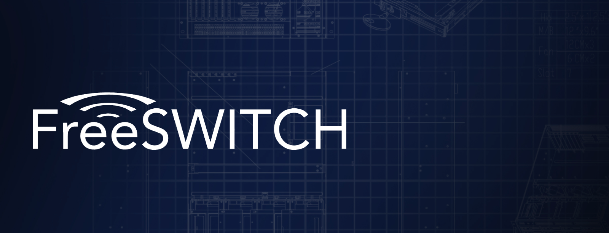

#### FreeSWITCH

FreeSWITCH is a scalable open source cross-platform telephony platform designed to route and interconnect popular communication protocols using audio, video, text, or any other form of media. It forms the backbone of our call control and management functionalities, enabling robust handling of voice communications.

#### RAG Knowledge

Retrieval-Augmented Generation (RAG) Knowledge technology combines the power of retrieval and generation to enhance the conversational capabilities of our Voice AI agents. By integrating RAG, HeyVoiceFlow can access a vast repository of information, ensuring that the responses generated are both accurate and contextually relevant.

#### OpenAI

Utilizing OpenAI's advanced AI models, HeyVoiceFlow enhances its natural language understanding and generation capabilities. This integration allows our platform to understand complex queries and generate natural, human-like responses, pushing the boundaries of what is possible with Voice AI technology.

#### Deepgram

Deepgram provides cutting-edge speech-to-text (STT) capabilities, enabling accurate transcription of audio to text. This technology is crucial for developing responsive and interactive voice AI systems that can understand spoken language in real-time.

#### ElevenLabs

ElevenLabs offers state-of-the-art text-to-speech (TTS) technology, allowing our Voice AI agents to deliver natural and engaging spoken responses. By incorporating ElevenLabs, HeyVoiceFlow ensures that the voice interactions are not only accurate but also pleasant and lifelike.

{/* 
## Setting up

The first step to world-class documentation is setting up your editing environments.

<CardGroup cols={2}>
  <Card
    title="Edit Your Docs"
    icon="pen-to-square"
    href="https://mintlify.com/docs/quickstart"
  >
    Get your docs set up locally for easy development
  </Card>
  <Card
    title="Preview Changes"
    icon="image"
    href="https://mintlify.com/docs/development"
  >
    Preview your changes before you push to make sure they're perfect
  </Card>
</CardGroup>

## Make it yours

Update your docs to your brand and add valuable content for the best user conversion.

<CardGroup cols={2}>
  <Card
    title="Customize Style"
    icon="palette"
    href="https://mintlify.com/docs/settings/global"
  >
    Customize your docs to your company's colors and brands
  </Card>
  <Card
    title="Reference APIs"
    icon="code"
    href="https://mintlify.com/docs/api-playground/openapi"
  >
    Automatically generate endpoints from an OpenAPI spec
  </Card>
  <Card
    title="Add Components"
    icon="screwdriver-wrench"
    href="https://mintlify.com/docs/content/components/accordions"
  >
    Build interactive features and designs to guide your users
  </Card>
  <Card
    title="Get Inspiration"
    icon="stars"
    href="https://mintlify.com/customers"
  >
    Check out our showcase of our favorite documentation
  </Card>
</CardGroup> */}
