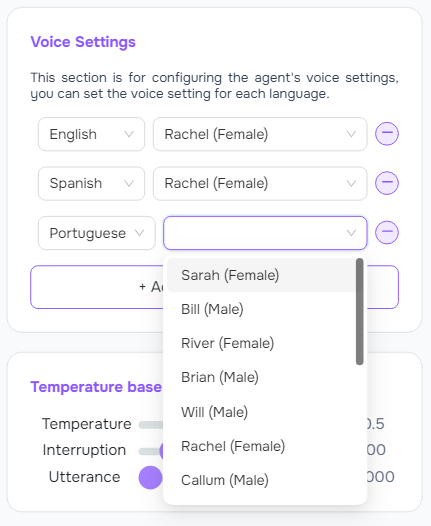

Your AI voice agent should reflect your brand’s personality—friendly, professional, or somewhere in between. With Voismo AI, you can customize everything from the voice to the script, ensuring your AI sounds just like you (or your client). Here’s how:

---

## 1. Assign the Phone Numbers

**What to do:** Purchase available phone numbers for assignment.
- **Request Number:** Request the numbers and wait for the Admin to reserve them.
    <Frame>
      
    </Frame>
- **Assign Number:** Assign the reserved numbers to your AI agents.

    <Frame>
      
    </Frame>

---

## 2. Cal.com Integration

**What to do:** Input the API Key to integrate with Cal.com
- **API_Key:** Obtain your API Key from Cal.com.
- **Event Types:** Select the Event Type the agent will use for appointment scheduling.
- **Example:** cal_live_b84******************da906ba833

<Tip>
**Pro Tip:** Use the after-hours message to manage expectations and build trust.
</Tip>

<Frame>
      
    </Frame>

---
## 3. Build Your Script

**What to do:** Use plain English to tell your AI what to say. No coding required!

- **Start with a greeting:**
<Note>
**Example:** “Hi, thanks for calling [Your Business]! How can I help you today?”
</Note>
- **Add FAQs:**
<Note>
**Example:** “We’re open Monday to Friday, 9 AM to 5 PM.”
</Note>
- **End with a call to action:**
<Note>
**Example:** “Would you like to book an appointment or hear more about our services?”
</Note>

<Tip>
**Pro Tip:** Keep it conversational. Imagine you’re talking to a customer in person.
</Tip>

<Frame>
      
    </Frame>

---
## 4. Choose a Voice Style

**What to do:** Pick a voice that matches your brand’s tone.

- **English (US):** Choose from a variety of American accents.
- **English (UK):** Opt for a British accent to add a touch of sophistication.
- **Spanish:** Perfect for reaching a broader audience in Spanish-speaking regions.
- **French:** Ideal for businesses targeting French-speaking customers.
- **German:** Great for a professional and precise tone.
- **Custom:** Upload your own recording for a truly unique touch.

<Tip>
**Pro Tip:** Test different voices to see which one resonates with your audience.
</Tip>

<Frame>
      
    </Frame>

---
## 4. Test and Tweak

**What to do:** Once you’ve customized your AI, test it out and make adjustments as needed.
- **Test Call:** Call your business number to hear your AI in action.
- **Edit Script:** Update the script based on customer feedback.
- **Change Voice:** Switch to a different voice if it doesn’t feel right.

<Tip>
**Pro Tip:** You can’t break anything. Experiment until it’s perfect!
</Tip>

<Frame>
      
    </Frame>

---
<Tip>
**Pro Tips for Customization**
- **Sound Natural:** Use contractions (e.g., “I’m” instead of “I am”) and avoid robotic phrasing.
- **Keep It Short:** Customers appreciate concise answers.
- **Add Personality:** Use phrases that reflect your brand’s vibe (e.g., “Howdy!” for a casual tone or “How may I assist you?” for a formal tone).
</Tip>

---
## What’s Next?

Your AI agent is ready to go live! If you need help, check out our [Video Library](https://voismoai.com) or chat with our support team.

👉 [Start Customizing](https://voismoai.com) – Make your AI sound like you in minutes.

👉 Need inspiration? [See examples](https://voismoai.com) of how other businesses customized their AI agents.

#### SCREENSOT