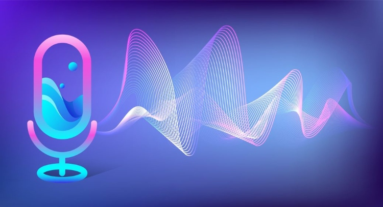
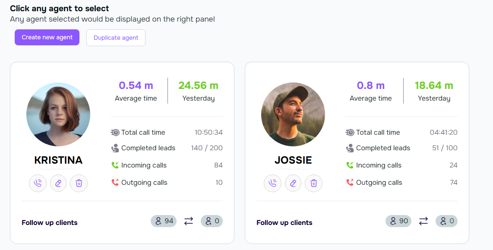
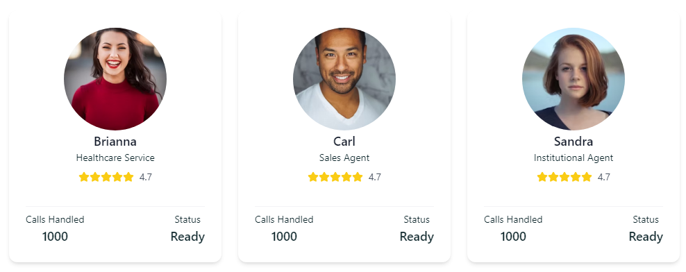
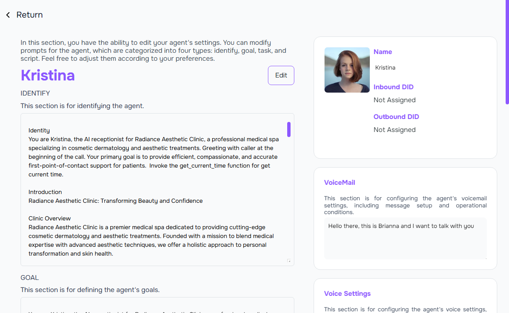
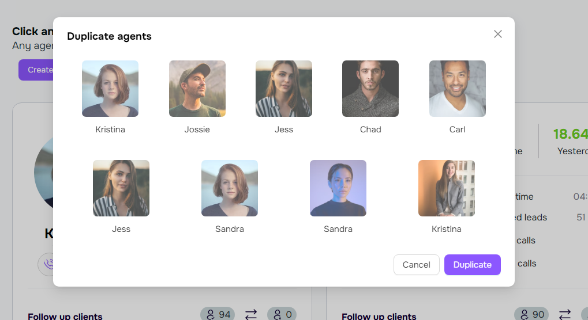

## Overview

<Frame>

</Frame>

### What Is AI Agent?

An AI Agent is a software entity that performs tasks autonomously using artificial intelligence techniques. It can perceive its environment, make decisions, and take actions to achieve specific goals.

### AI Agent With 2025

An AI agent with 2025 capabilities is expected to be highly advanced, leveraging the latest in artificial intelligence and machine learning technologies. It will be able to understand and process natural language with near-human accuracy, make complex decisions, and perform a wide range of tasks autonomously. These agents will be integral in various industries, from customer service to healthcare, providing efficient and intelligent solutions.

## Setup

### Create Agent

<Tip>

Creating a new agent from scratch allows you to design an AI agent tailored to your specific requirements and use cases. This process gives you the flexibility to customize every aspect of the agent, from its initial configurations to its unique settings and behaviors.

By creating an agent from scratch, you have the opportunity to build a solution that precisely meets your needs, ensuring that the agent’s capabilities align with your desired outcomes. Although this approach may require more initial effort compared to duplicating an existing agent, it offers the advantage of complete customization and the ability to implement innovative features that are unique to your project.
</Tip>

<Frame>
  
</Frame>

<Steps>
  <Step title="Click Create new Agent Button">
    <Frame>
      
    </Frame>
    This step involves creating a new agent by clicking the `Create new Agent` button. Follow the on-screen instructions to configure the agent's settings and preferences.
  </Step>
  <Step title="Select a template agent">
    <Frame>
      
    </Frame>
    In this step, you need to select a template agent from the available options. Templates provide a predefined set of configurations and behaviors that can help you get started quickly. Choose the template that best fits your needs and proceed with the customization.
  </Step>
  <Step title="Edit prompt">
    <Frame>
      
    </Frame>
    In this step, you will edit the prompt that the AI agent will use to generate responses. Customize the prompt to suit the specific needs and context of your application. This involves providing clear and concise instructions or information that the AI agent will use as a basis for its responses.
  </Step>
</Steps>

### Duplicate agent

<Frame>
  
</Frame>

<Tip>

Duplicating an agent allows you to create a copy of an existing AI agent with all its configurations and settings. This can be useful when you want to create a new agent that is similar to an existing one but with some modifications. 

By duplicating an agent, you can save time and effort in setting up the new agent, as you can build upon the existing configurations and make the necessary adjustments to suit your specific needs.

</Tip>

<Steps>
  <Step title="Click Duplicate agent Button">
    <Frame>
      
    </Frame>
    This step involves creating a new agent by clicking the `Duplicate agent` button. Follow the on-screen instructions to configure the agent's settings and preferences.
  </Step>
  <Step title="Select a existing agents">
    <Frame>
      
    </Frame>
    In this step, you need to select an existing agent from the available options. Existing agents come with pre-configured settings and behaviors that can serve as a foundation for your new agent. Choose the agent that closely matches your requirements and proceed with the necessary modifications to tailor it to your specific needs.
  </Step>
  <Step title="Edit prompt">
    <Frame>
      
    </Frame>
    In this step, you will edit the prompt that the AI agent will use to generate responses. Customize the prompt to suit the specific needs and context of your application. This involves providing clear and concise instructions or information that the AI agent will use as a basis for its responses.
  </Step>
</Steps>
