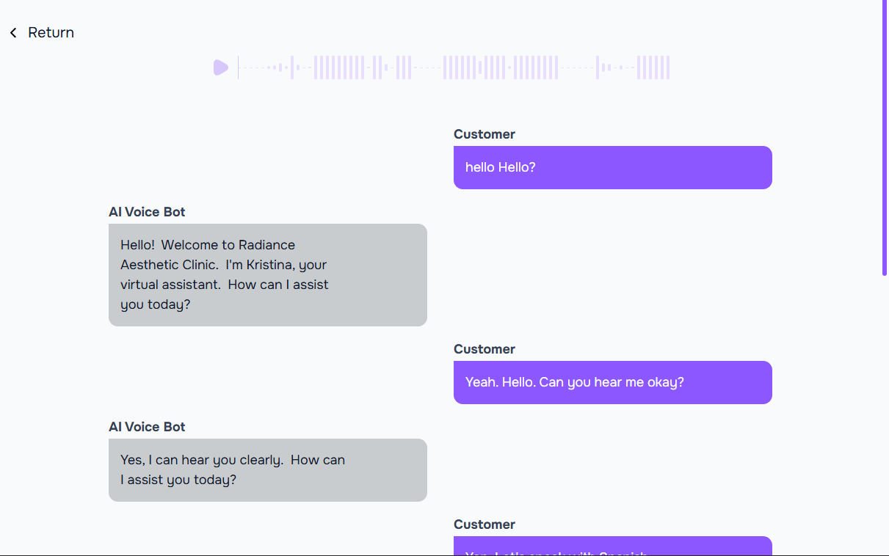

<Frame>

</Frame>

## Call Log Details

Call logs provide a detailed record of all incoming and outgoing calls. Each call log entry includes the following information:

- **Call Type**: Indicates whether the call was inbound (received) or outbound (made).
- **Duration**: The length of the call, typically displayed in minutes and seconds.
- **View Transcription**: An option to view the transcription of the call, if available. This feature allows you to read the conversation that took place during the call.
- **Delete**: An option to delete the call log entry. This is useful for managing and organizing your call history.
- **Get Summary**: A feature that provides a summary of the call, including key points and important information discussed during the call.

### Call Transcription
<Frame>
  
</Frame>

### Call Summary

<Frame>
  
</Frame>
