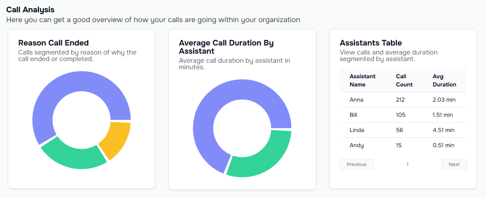

<Tip>

The agent platform dashboard page provides a summary of total call minutes, number of calls, total spent, and average cost per call.

</Tip>

## Overview

The agent platform overview page provides a summary of total call minutes, number of calls, total spent, and average cost per call.

<Frame>

</Frame>

| Field                 | Usage                                | Sample Data          |
| --------------------- | ------------------------------------ | -------------------- |
| Total Call Minutes    | Calculated from total call duration  | 1023 mins            |
| Number of Calls       | Calculated from total number of calls| 100 calls            |
| Total Spent           | Calculated from total cost of calls  | $1000.00             |
| Average Cost Per Call | Calculated from total cost of calls  | $10.00 per call      |

## Call Analysis

<Frame>

</Frame>

The Call Analysis section provides insights into the performance and cost-effectiveness of your calls. It includes metrics such as total call minutes, number of calls, total spent, and average cost per call.

### Total Call Minutes

This metric is derived from the cumulative duration of all calls made. It helps in understanding the overall usage of the calling platform.

### Number of Calls

This represents the total count of calls made within a specific period. It is useful for tracking call volume and frequency.

### Total Spent

This is the total expenditure on calls, calculated by summing up the cost of each call. It provides a clear picture of the financial investment in communication.

### Average Cost Per Call

This metric is calculated by dividing the total spent by the number of calls. It helps in assessing the cost efficiency of each call made.

By analyzing these metrics, you can optimize your calling strategy and manage costs effectively.
