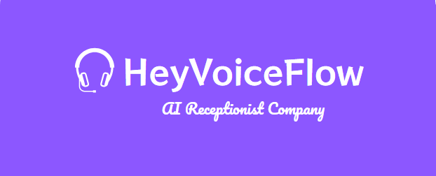
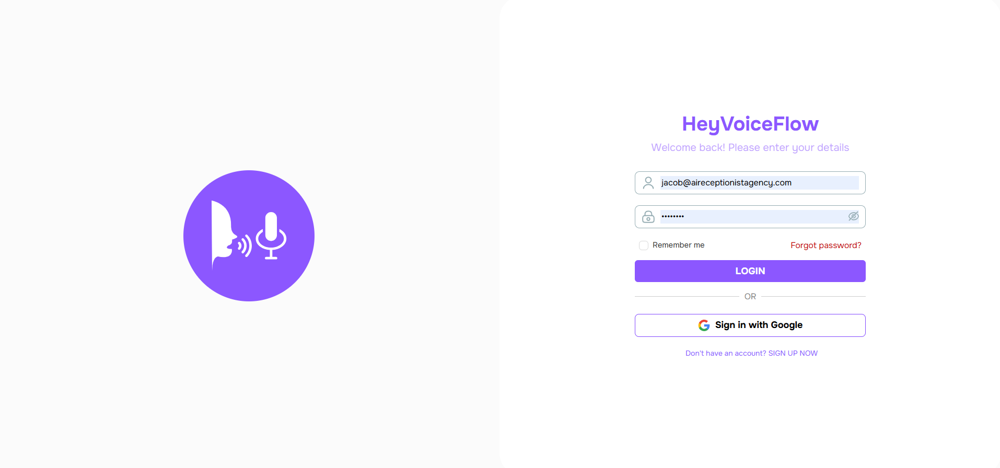

{/*  */}

**Welcome to Voismo AI! Creating your first AI voice agent is quick, easy, and requires no technical skills. Follow these simple steps to get started:**

<Steps>
  <Step title="Sign Up">
    - **What to do:** Just enter your email address and create a password. No credit card is required to start your free trial.
    - **Why it’s easy:** No coding, no complicated forms—just a few clicks and you’re in.
  
    <Frame>  
      
    </Frame>
    <Frame>  
      
    </Frame>
    <Frame>  
      
    </Frame>
  </Step>
  <Step title="Pick a Goal">

  **What to do:** Choose what you want your AI agent to do. We’ve made it simple with pre-built goals
    - **Answer customer calls:** Let your AI handle FAQs, bookings, and more.
    - **Automate cold calls:** Perfect for sales teams or freelancers.
    - **Book appointments:** Ideal for service-based businesses like salons or clinics.
    - Conduct vendor research. 

  **Why it’s easy:** Just click the goal that matches your needs, and we’ll guide you from there.
  </Step>
  <Step title="Customize">
    **What to do:** Make your AI agent sound and feel like your business:
    - Add your business name: Personalize the greeting (e.g., “Hi, thanks for calling [Your Business]!”).
    - Set your hours: Let your AI know when you’re open or closed.
    - Pick a voice: Choose from friendly, professional, or upload your own recording for a custom touch.

    **Why it’s easy:** Everything is editable in plain English—no technical jargon.

    <Frame>  
      
    </Frame>
    <Frame>
      
    </Frame>
  </Step>
  <Step title="Go Live">
    **What to do:** Once you’re happy with your setup, click “Go Live.” Your AI agent will start working 24/7.
    **Why it’s easy:** No need to download software or configure servers—just turn it on and let it work.

    <Frame>
      
    </Frame>
  </Step>
</Steps>

---
## What’s Next?

- **Test it out:** Call your business number to hear your AI in action.

- **Tweak as needed:** You can always edit your script, voice, or settings—no pressure to get it perfect the first time.

- **Need help?** Check out our Video Library or chat with our support team.

<Tip>
Experiment!

You can’t break anything. Try different voices, scripts, or goals to see what works best for your business. Your AI agent is like a virtual team member—train it to fit your needs!
</Tip>
