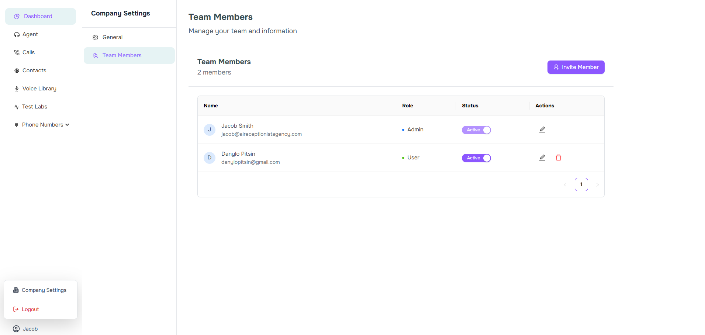
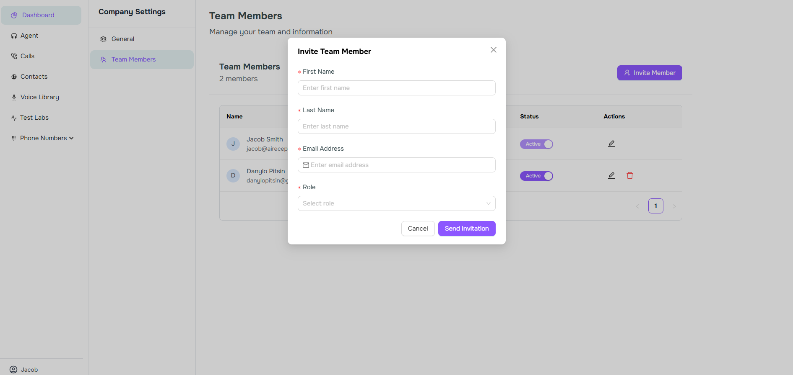
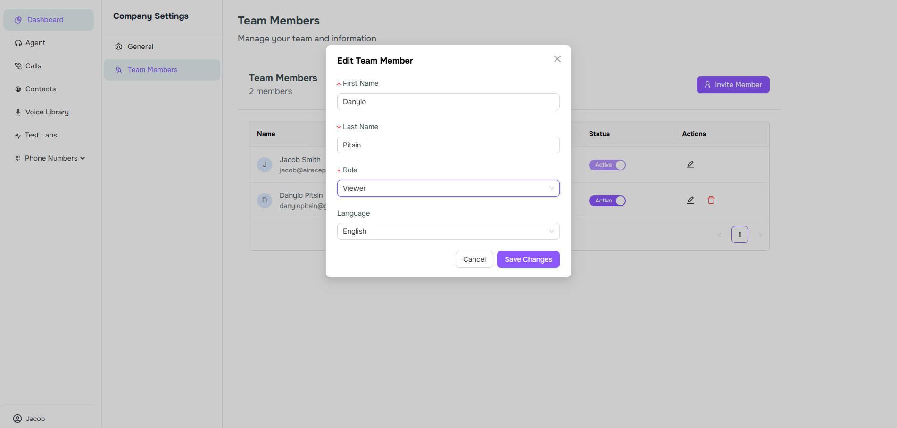

Effectively managing your team is crucial for maintaining a productive workspace in Voismo AI. This guide will walk you through the process of inviting team members, assigning roles, and managing user access.

## Inviting Team Members

You can easily invite new members to join your Voismo AI workspace by following these steps:

1. Navigate to the **Company Settings** section in the left sidebar
2. Select the **Team Members** menu
3. Click the **Invite Member** button in the top-right corner
4. Enter the email addresses of the people you want to invite
5. Click **Send Invitation**

Invitees will receive an email with instructions to join your workspace. The invitation link will remain valid for 7 days.

<Frame>
    
</Frame>
*  *
<Frame>
    
</Frame>

## Managing Team Roles

Voismo AI offers different role levels to control what team members can access and modify within your workspace.

### Available Roles

| Role | Description | Capabilities |
|------|-------------|--------------|
| Admin | Full access to all workspace settings and features | Can manage billing, workspace settings, invite/remove users, and assign roles |
| Editor | Can create and modify content | Can create new voice flows, edit existing ones, and view analytics |
| Viewer | Read-only access | Can view voice flows and basic analytics, but cannot make changes |

### Changing User Roles

To change a team member's role:

1. Go to **Settings** > **Team Management**
2. Find the user in the team members list
3. Click the Edit button
4. Select the new role
5. Click **Save Changes**

<Frame>
    
</Frame>

## Activating and Deactivating Users

You can temporarily disable access for team members without permanently removing them from your workspace.

### Deactivating a User

When you deactivate a user:
- Their access to the workspace is immediately revoked
- Their account remains in your workspace with all settings preserved
- They will not count against your active user limit for billing purposes

To deactivate a user:

1. Go to **Settings** > **Team Management**
2. Find the user in the team members list
3. Toggle the **Active** switch to the off position
4. Confirm the deactivation in the dialog that appears

### Reactivating a User

To restore access for a deactivated user:

1. Go to **Settings** > **Team Management**
2. Click the **Show Inactive Users** filter at the top of the team list
3. Find the inactive user
4. Toggle the **Active** switch to the on position

## Removing Team Members

To permanently remove a team member from your workspace:

1. Go to **Settings** > **Team Management**
2. Find the user in the team members list
3. Click the Delete button to remove the user
5. Confirm the removal in the dialog that appears

<Note>
Removing a user is permanent. If you want to temporarily disable access, consider deactivating the user instead.
</Note>

## Best Practices

- **Regular audits**: Periodically review your team members and their access levels
- **Principle of least privilege**: Assign users the minimum level of access required for their role
- **Offboarding**: Promptly remove access for departing team members
- **Custom roles**: Create role-specific permissions for specialized teams

For more detailed information about security and compliance, visit our [Security & Compliance](/security) documentation page.