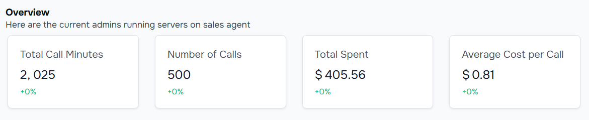
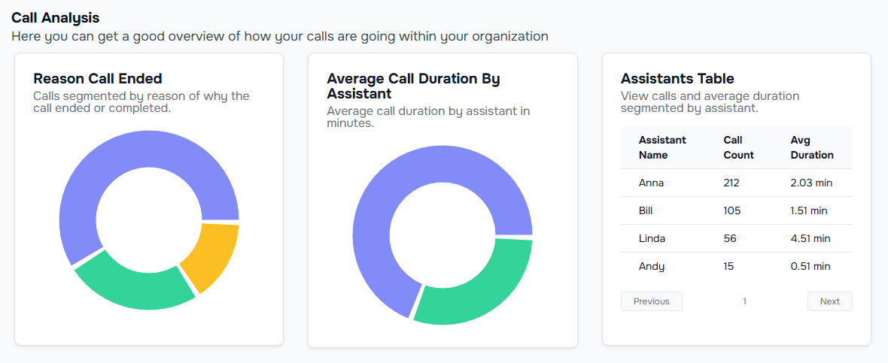

Voismo AI is designed to adapt to your needs—whether you’re a small business owner, freelancer, or agency. Here are some real-world examples to spark your creativity:

## 1. Never Call Again Service

<Tip>
**Ideal for:** Wedding planners, realtors, contractors, or anyone who needs to research vendors or services.
</Tip>

### How it works
- Your AI agent calls vendors, collects quotes, and texts the results to you or your client.
- No more spending hours on the phone—your AI does the legwork.

#### How to Set It up
☑️ Choose the “Vendor Research” template.

☑️ Add questions for the AI to ask 
(e.g., “What’s your Saturday venue fee?” or “Do you offer delivery?”).

☑️ Connect to SMS for real-time updates.

<Note>
Examples

- **Wedding Planner:** AI calls venues, florists, and caterers to compare prices and availability.
- **Realtor:** AI contacts contractors for home repair quotes.
</Note>

#### SCREENSOT

## 2. 24/7 Customer Support

<Tip>
**Ideal for:** Retailers, service providers, or anyone who gets repetitive customer questions.
</Tip>

### How it works
- Your AI answers FAQs, even at midnight.
- Questions like “What’s your return policy?” or “Do you deliver?” are handled automatically.

#### How to Set It Up
☑️ Choose the “Customer Support” template.

☑️ Add your business FAQs (e.g., “We offer free returns within 30 days.”).

☑️ Customize the voice to match your brand.

#### SCREENSOT

## 3. Automated Cold Calling

<Tip>
**Ideal for:** Sales teams, freelancers, or agencies managing outreach campaigns.
</Tip>

### How it works
- Your AI agent calls leads, follows up, and schedules appointments.
- No more cold-calling anxiety—your AI does the talking.

#### How to Set It Up
☑️ Choose the “Sales Pro” template.

☑️ Upload your contact list.

☑️ Customize the script (e.g., “Hi, this is [Your Business]. We’re offering a special discount this month!”).

<Note>
**Example**

- **Freelancer:** AI follows up with leads from a recent networking event.
- **Agency:** AI manages cold-calling campaigns for multiple clients.
</Note>

<Frame>  
      
    </Frame>
    <Frame>
      

    </Frame>

## 4. Appointment Booking

<Tip>
**Ideal for:** Salons, clinics, consultants, or anyone who schedules appointments.
</Tip>

### How it works
- Your AI agent answers calls, checks availability, and books appointments.
- No more double-bookings or missed calls.

#### How to Set It Up
☑️ Choose the “Appointment Booker” template.

☑️ Sync your calendar (e.g., Cal.com).

☑️ Customize the script (e.g., “Hi, thanks for calling [Your Business]. What day works for you?”).

<Note>
**Example**

- **Salon Owner:** AI books haircuts, color appointments, and consultations.
- **Consultant:** AI schedules client calls and sends reminders.
</Note>

#### SCREENSOT

## 5. Lead Qualification

<Tip>
**ideal for:** Sales teams, agencies, or freelancers managing inbound leads.
</Tip>

### How it workflows

- Your AI agent calls leads, asks qualifying questions, and prioritizes hot leads.
- Save time by focusing on the most promising opportunities.

#### How to Set It Up

☑️ Choose the “Lead Qualifier” template.

☑️ Add qualifying questions (e.g., “What’s your budget?” or “When are you looking to buy?”).

☑️ Connect to your CRM for seamless lead tracking.

<Note>
**Example**

- **Real Estate Agent:** AI qualifies leads by asking about budget, location, and timeline.
- **Marketing Agency:** AI identifies high-intent leads for follow-up.
</Note>

#### SCREENSOT

---
## What Will You Build?

These are just a few ideas to get you started. With Voismo AI, the possibilities are endless. Whether you’re automating calls for your business or creating AI agents for clients, you’re just a few clicks away from saving time and growing faster.

👉 [Start Your Free Trial](https://voismoai.com) – No credit card. No setup fees. Cancel anytime.

👉 Need inspiration? [Chat with us](https://voismoai.com) – We’ll help you brainstorm the perfect use case!