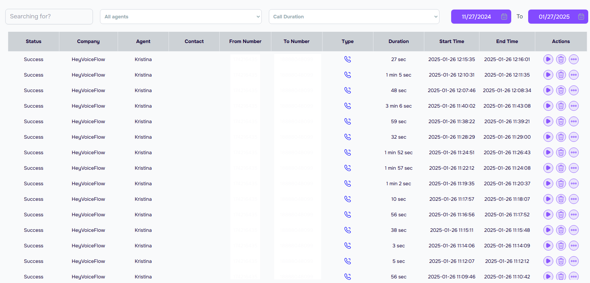

Think of Call Logs as your business's phone diary - it keeps track of every conversation your AI assistant has with your customers. Just like checking your email inbox or text messages, you can see who called, when they called, and what was discussed.

<Frame>
      
    </Frame>

## Quick Actions - Get Things Done Fast!

**Need to do something quickly? Here's how:**
- **📥 Download a Call:** Click the download icon next to any call
- **📋 Share a Transcript:** Use the "Share" button and enter your team member's email
- **🏷️ Tag Important Calls:** Click the flag icon to mark priority calls
- **🔔 Set Up Alerts:** Choose "Notifications" to get alerts for specific call types

---
## Finding What You Need
### Sort and Filter Your Calls

[INSERT SCREENSHOT]

- **🔍 Search by Customer:** Type a name or phone number
- **📅 Filter by Date:** Choose today, yesterday, or pick a date range
- **⏱️ Filter by Duration:** Find short calls or lengthy conversations
- **📊 Group by Time:** See your busiest call periods

### Understanding Call Status
**Every call has a color-coded status:**
- **🟢 Green** - Success: Call handled perfectly by your AI
- **🟡 Yellow** - Partial Success: AI needed some human help
- **🔴 Red** - Needs Attention: Should be reviewed by your team

## What You'll Find in Your Call Logs
### The Main Call List

**Every call appears in an easy-to-read list showing you:**
- Who called (or who your AI called)
- When the call happened
- How long the call lasted
- What happened during the call

<Tip>
**Pro Tip:** Looking for a specific call? Use the search bar at the top to find calls by phone number, date, or customer name!
</Tip>

## Working with Your Team
**Sharing and Collaborating**

[INSERT SCREENSHOT]

- **✉️ Share Calls:** Send transcripts to team members
- **📝 Add Notes:** Write comments on important calls
- **🚩 Flag for Review:** Mark calls that need attention
- **👥 Team Access:** Set who can see what

## Understanding Call Details
### For Each Call, You Can See:

**📞 Call Direction**
- **Incoming:** When someone calls your business
- **Outgoing:** When your AI makes calls for you

**⏱️ Call Length**
- See exactly how long each conversation took
- Perfect for tracking if calls are being handled efficiently

**🗣️ Call Recording and Transcript**

[INSERT SCREENSHOT]

**Click "View Transcription" to see:**
- The entire conversation written out
- What your customers asked
- How your AI responded
- Any important details discussed

## Real Business Examples
**How Different Businesses Use Call Logs**

**💇‍♀️ Sarah's Salon**
- Reviews appointment details
- Checks client preferences
- Confirms styling requests

**🍕 Joe's Pizza**
- Verifies delivery orders
- Reviews special instructions
- Tracks busy ordering times

**👩‍⚕️ City Medical Center**
- Confirms appointment bookings
- Tracks prescription refill requests
- Monitors urgent calls

## Understanding Your Call Patterns
**Analytics At a Glance**

[INSERT SCREENSHOT]

**Track important trends:**
- 📊 Busiest call hours
- ⏰ Average call length
- 📈 Success rate trends
- 🔄 Common request types

## Exporting and Reporting
**Getting Your Data**

**Need reports? Easy!**
- **📥 Weekly Reports:** Auto-generated every Monday
- **📊 Excel Export:** Download call data for analysis
- **📄 PDF Transcripts:** Save conversations for reference
- **📋 Custom Reports:** Choose exactly what you want to see

## Keeping Information Safe
**Privacy and Security**

**Your data is protected:**
- 🔒 Bank-level encryption
- ⏰ Automatic data backup
- 👥 Controlled team access
- 📝 Clear retention policies

## Making the Most of Your Call Logs
### Daily Best Practices

**👉 Morning Review:** Check yesterday's calls to catch any missed items 

**👉 Quality Check:** Listen to a few calls to ensure your AI is handling things well 

**👉 Follow Up:** Use transcripts to verify details when customers have questions

### Using Call Logs to Improve
- Notice common questions? Add them to your AI's knowledge base
- See longer call times? Adjust your AI's responses to be more efficient
- Spot missed opportunities? Update your AI's skills to handle them better

## Need Help?
**Can't find what you're looking for?**
- Click the "Support" button in the top right
- Email us at help@voismoai.com
- Check our video guides for detailed walkthroughs

### Quick Support Options
- **💬 Live Chat:** Available 9am-5pm EST
- **📧 Email:** 24/7 support
- **📱 Phone:** Priority support line
- **📺 Video Guides:** Step-by-step tutorials

---
<Tip>
**Remember:** Your call logs are like a helpful assistant taking detailed notes of every call. Use them to stay organized, improve your service, and never miss important customer interactions!
</Tip>

<Tip>
**Pro Tip:** Bookmark this guide for quick reference. And remember, our support team is just a click away if you need help!
</Tip>

