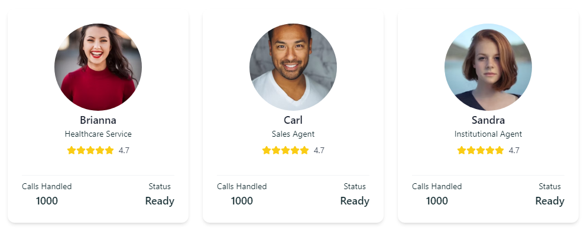
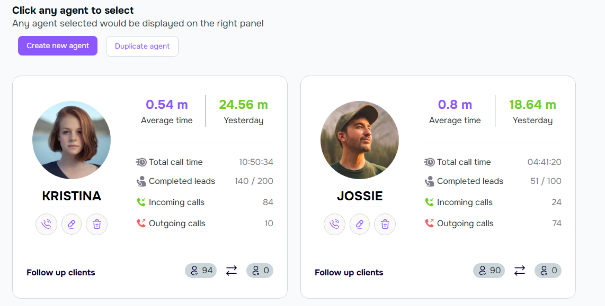

Think of AI voice assistants as friendly team members who help manage your calls. They're like having dedicated receptionists who work 24/7, never take breaks, and always follow your instructions exactly. Let's learn how to create and customize them!

---
## What's an AI Voice Assistant?

<Frame>
      
    </Frame>

**Simply put, your AI voice assistant is like a smart phone operator who can:**
- Answer customer calls professionally
- Book appointments
- Make outbound calls
- Answer common questions about your business
- Follow up with clients

**The best part? They learn from your instructions and get better over time!**

---
## Making Your Assistant Sound Just Right
### Choosing Your Voice Style

<Frame>
      
    </Frame>

**Your AI assistant can sound exactly how you want! Choose from:**
- **Friendly & Casual:** Perfect for retail, restaurants, and creative businesses
- **Professional & Polished:** Ideal for medical offices, law firms, and financial services
- **Energetic & Upbeat:** Great for fitness centers, entertainment venues, and events
- **Warm & Caring:** Wonderful for healthcare, therapy, and wellness services

---
### Want to use your own voice?

<Steps>
  <Step title="Click &quot;Custom Voice&quot;"/>
  <Step title="Record a few sample sentences"/>
  <Step title="Your AI will learn to speak just like you!"/>
</Steps>

<Tip>
**Pro Tip:** Test different voices with your team or family before going live. Sometimes what sounds good to you might sound different to others!
</Tip>

---
## Creating Your First Assistant
### Method 1: Start Fresh with a New Assistant

<Frame>
      
    </Frame>

<Steps>
  <Step title="Click &quot;Create new Agent&quot;">
    - Look for the purple button at the top of your screen
    - This starts your journey to create a custom assistant
  </Step>
  <Step title="Choose a Template">
    Show Image Pick a template that matches your needs You'll see friendly faces like:
      - Brianna (Perfect for scheduling appointments)
      - Carl (Great for sales calls)
      - Sandra (Expert at customer service)
    <Tip>
      **Pro Tip:** Don't worry about picking the "perfect" template - you can always adjust everything later!
    </Tip>
  </Step>
  <Step title="Make It Your Own">
    Show Image Tell your assistant how to handle calls Here you can:
    - Set your business hours
    - Add your pricing information
    - Include common questions and answers
    - Choose how formal or casual you want them to sound
  </Step>
</Steps>

### Method 2: Copy an Existing Assistant

Sometimes it's easier to start with something that's already working and modify it. That's where the duplicate feature comes in handy!

<Steps>
  <Step title="Click &quot;Duplicate agent&quot;">
    Show Image Find the duplicate button near your existing assistant
  </Step>
  <Step title="Pick Which Assistant to Cop">
    Show Image Choose any assistant you've already set up
  </Step>
  <Step title="Customize Your Copy">
    - Make small changes to create a variation
    - Perfect for creating similar assistants for different services
  </Step>
</Steps>

---
## Real Business Success Stories

### Sarah's Bakery 🧁

**Their Challenge:** Missing cake orders during busy baking times **Their Solution:** AI assistant that takes orders and sends detailed summaries

**Customer:** "Hi, I need a birthday cake for next Saturday."

**AI:** "I'd love to help with your birthday cake! We have chocolate, vanilla, and red velvet. Which flavor interests you?"

### Dr. Smith's Dental Office 🦷

**Their Challenge:** Too many calls about basic appointments **Their Solution:** AI that handles scheduling and insurance questions

**Customer:** "I need to book a cleaning."

**AI:** "I can help you schedule a cleaning. We have openings next Tuesday at 2 PM or Wednesday at 10 AM. Would either of those work for you?"

---
## Making Your Assistant Smarter
**Common Settings Every Business Should Check**

**📅 Business Hours**
- Set regular hours
- Add holiday schedules
- Create special event times
- Handle after-hours calls

**📱 Call Routing**
- Send urgent calls to your cell
- Direct sales calls to your team
- Route support to specific departments
- Set up VIP caller rules

---
## Best Practices for Success
### Writing Great Responses

**✅ Do:**
- Keep greetings short and friendly
- Include your business name
- Offer clear choices
- Use everyday language

**❌ Avoid:**
- Long, complex sentences
- Industry jargon
- Too many questions at once
- Robotic language

### Sample Scripts That Work
**Good Morning Greeting:**

```
"Thanks for calling [Your Business]! I'm your virtual assistant, here to help with appointments, questions, or anything else you need."

Handling Unclear Requests:
"I want to make sure I help you correctly. Are you calling about: 

1. Making an appointment

2. Checking our hours

3. Getting our prices

4. Something else?"
```

---
## Checking How Your Assistant is Doing
**Performance Dashboard**

<Frame>
      
    </Frame>

**Watch these numbers:**
- **Call Success Rate:** How many calls were handled perfectly
- **Average Call Time:** How long conversations typically last
- **Customer Satisfaction:** Feedback from callers
Missed Questions: Topics your AI needs help with

---
## Frequently Asked Questions

**"What if my assistant doesn't understand something?"**

Your AI will politely ask for clarification or offer to connect with a human team member. It never guesses!

**"Can I change my assistant's voice later?"**

Yes! Change voices anytime - your script and settings stay the same.

**"What happens during internet problems?"**

Don't worry! Calls automatically forward to your backup number if there's any technical issue.

**"How many assistants can I create?"**

It depends on your plan:
- Starter: 1 assistant
- Professional: 5 assistants
- Enterprise: Unlimited

---
## Quick Tips for Success

👉 **Start Simple:** Begin with basic greetings and common questions 

👉 **Test It Out:** Call your own number to hear how it sounds 

👉 **Update Anytime:** Add more information as you think of it 

👉 **Be Specific:** The more details you provide, the better your assistant performs

---
## Need Help?

- Click the "Support" button in the top right
- Email us at [INSERT EMAIL HERE]@voismoai.com
- Check out our video tutorials for step-by-step guidance

<Tip>
**Remember:** There's no "wrong way" to set up your assistant. You can always make changes and improvements as you go!
</Tip>

---
<Tip>
**Pro Tip:** Start with one assistant and get comfortable before creating more. It's like training a new team member - take your time to get it right!
</Tip>