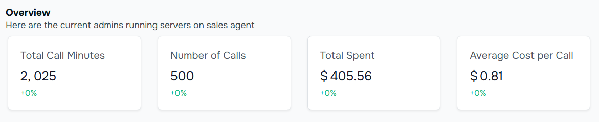

Welcome to your command center! Think of your dashboard as your business's phone management hub - it's where you can see everything happening with your AI voice agent at a glance.

<Frame>  
      
    </Frame>
    <Frame>
      
    </Frame>

## What You'll See on Your Dashboard
### 1. Your Daily Overview

At the top of your screen, you'll find four important numbers that tell you how your AI agent is doing:

Screenshot #1: Full Dashboard Overview

Screenshot #2: Key Metrics Cards

**Total Call Minutes:** How long your AI has spent talking to people
- **Example:** "2,025 minutes" means your AI has had about 34 hours of conversations
- **Look for this:** in the first blue card on the left

**Number of Calls:** How many calls your AI has handled
- **Example:** "500 calls" shows your AI is keeping busy answering customers
- **Find this:** in the second card

**Total Spent:** How much you've invested in your AI calls
- **Example:** "$405.56" means you're spending less than hiring a full-time receptionist
- **Located in:** the third card

**Average Cost Per Call:** How much each call typically costs
- **Example:** "$0.81 per call - that's less than a cup of coffee!
- **See this:** in the rightmost card

### 2. Easy-to-Read Charts
#### Call Results Chart (The Colorful Circle)

<Frame>
      
    </Frame>

<Note>
**This colorful pie chart shows you**
- **Green sections:** Successful calls completed on the first try
- **Yellow sections:** Calls that needed a follow-up
Red sections: Calls that might need your attention
</Note>

<Tip>
**Pro Tip:** Aim for more green! The bigger the green section, the more calls your AI is handling perfectly.
</Tip>

#### Call Duration Chart (The Time Tracker)

<Frame>
      
    </Frame>

<Note>
**This helpful chart shows**

- Average call length (the bold line)
- Busy times (the peaks)
- Quiet times (the valleys)
</Note>

<Tip>
**Quick Tip:** Use this to spot when you're busiest and make sure your AI is ready for those peak times.
</Tip>

{/* ### 3. Your AI Assistant's Performance Table

<Note>
**This simple table shows you**
- Names of your AI assistants
- Number of calls they've handled
- Average time spent on each call
</Note>

<Tip>
**Helpful Hint:** Use this to see which AI assistants are your top performers!
</Tip>

## Making the Most of Your Dashboard
### Quick Navigation

Screenshot #6: Quick Access Features */}

{/* <Note>
**From your dashboard, you can easily**
- Click "Agents" to adjust your AI's settings
- View "Call Logs" to see detailed call information
- Use "Quick Start" to set up new features
</Note>

<Tip>
**Quick Tips**
- **Morning Check:** Take a quick look each morning to see yesterday's activity
- **Weekly Review:** Check your total calls and costs every Monday
- **Monthly Planning:** Use the total spent tracker to budget for next month
</Tip> */}

## Help When You Need It

{/* [INSERT SCREENSHOT HERE] */}

<Note>
**Not sure about something you're seeing? You have three easy options**
- Click the "Support" button in the top right corner
- Email us at help@voismoai.com
- Use our live chat during business hours
</Note>

## Coming Up Next

**Want to get more from your dashboard? Check out these guides:**

- "Setting Up Your First AI Agent"
- "Understanding Your Call Reports"
- "Tips for Reducing Call Costs"

<Note>
**Remember:** Your dashboard is designed to be simple and helpful. No technical knowledge needed - just like checking your email or social media feed!
</Note>

---
<Tip>
**Pro Tip:** Pin your dashboard tab in your browser for easy access throughout the day. It's your window into how your AI is helping your business grow!
</Tip>

<Note>
**Note:** Screenshots in this guide are updated monthly to ensure they match what you see in your dashboard. If something looks different, we might have just released an improvement! Contact our support team for help finding anything.
</Note>